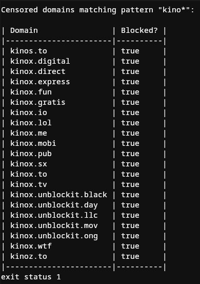

# DNS Tools

The DNS tools are useful to find out if the ISP is blocking the domain or whether it's really just
a DNS resolver related problem. Behind the scenes, right now, it is using the `cuuiliste.de` as an
embedded blocklist. Maybe there might be better datasets in the future and embedded, too, but this
is good enough right now.

## Screenshot



## Blocklists

Before building, make sure to download the `cuuiliste.json` file to get the updated blocklist.

```bash
cd /path/to/dns-tools;

# Download updated cuuiliste
wget https://api.cuuiliste.de/blocked_domains -O blocklists/cuuiliste.json;
```

## Dependencies

none (Pure Go implementation)

## Usage

```bash
# Search with suffix
dns-iscensored *.kinox.to; # exit code 1, blocked

# Search with midfix
dns-iscensored cookie*.engineer; # exit code 0, not blocked (hopefully)

# Search with prefix
dns-iscensored www4.kino*; # exit code 1, blocked
```
