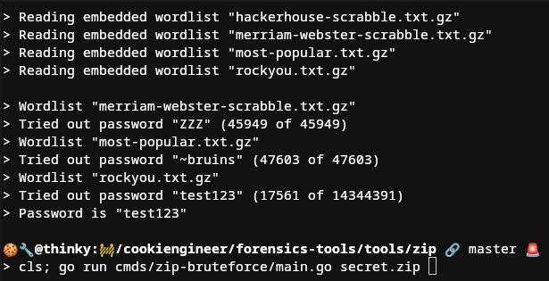

# ZIP Tools

The ZIP tools are useful to extract ZIP files when they're encrypted with a password or obfuscated.
As the ZIP header is static because there's only a couple of variants possible, there's also the
chance to be able to unmask an XOR encrypted ZIP stream that many hackers are not aware of.

## Screenshot



## Wordlists

You can embed wordlists into the [wordlists](/wordlists) folder, either as a raw `.txt` file or as
a `.txt.gz` file. All wordlists must have newline (`\n`) separated passwords, and nothing else.

## Dependencies

- [zip](https://github.com/yeka/zip)

## Usage

```bash
# Example file
echo "Test Contents" > secret.txt;

# Enter password
zip -e secret.zip secret.txt;

# Bruteforce with embedded wordlists
zip-bruteforce secret.zip;
```
